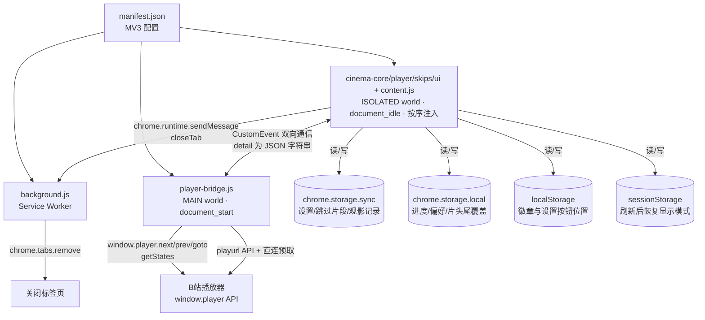
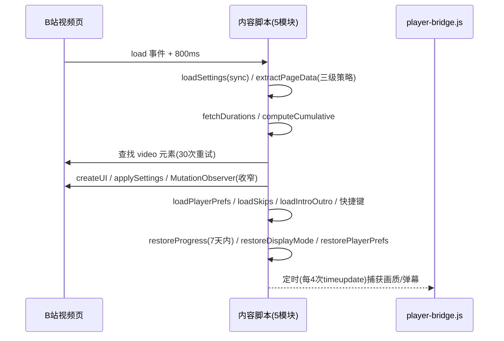
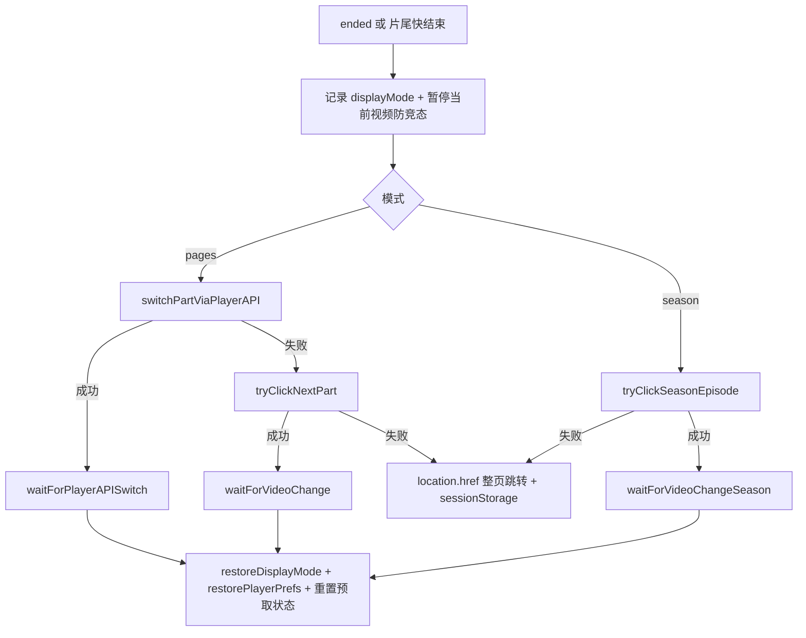
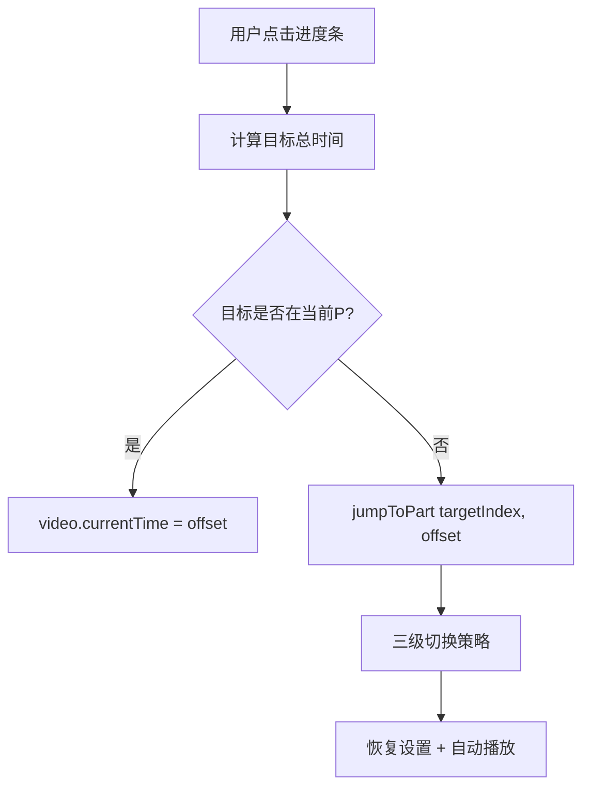

# B站影院模式 - Code Wiki

> 将 B 站分 P 视频整合为一部完整电影的浏览器扩展（Manifest V3）。
> 核心能力：无缝自动连播、统一进度条、隐藏分 P 界面、记忆播放进度、跳过片头片尾、合集视频支持。

---

## 1. 项目概览

| 项目 | 说明 |
|---|---|
| 名称 | B站影院模式 - 分P无缝连播 |
| 版本 | 1.7.3 |
| 类型 | Chrome 扩展（Manifest V3） |
| 匹配站点 | `*://www.bilibili.com/video/*` |
| 权限 | `storage`（本地持久化）、`tabs`（关闭标签页） |
| 构建方式 | 无构建步骤，纯静态 JS/CSS，直接加载目录即可 |
| 测试 | `node --test tests/unit.test.js`（注意：传目录 `tests/` 在 Node v24.2.0 会报 MODULE_NOT_FOUND，必须显式指定文件路径） |
| 文件组成 | `manifest.json`、`background.js`（20 行）、`cinema-utils.js`（纯函数库，浏览器/Node 双环境 UMD，289 行，13 个纯函数）、`cinema-core.js`（配置/状态/存储，499 行）、`cinema-player.js`（播放控制，1542 行）、`cinema-skips.js`（跳过片段，161 行）、`cinema-ui.js`（界面，1579 行）、`content.js`（引导，365 行）、`player-bridge.js`（863 行，预取字节合成/P2P 屏蔽）、`content.css`（1295 行）、`tests/unit.test.js`（19 用例） |

> **v1.1.0 说明**：原单文件 `content.js`（2789 行）已按职责拆分为 5 个模块文件（见 3.3）。
> **v1.2.0 说明**：新增 `cinema-utils.js` 纯函数模块（`cinema-core` 等改为引用其中的 `formatTime`/`buildCumulative`/`overallToPartOffset`/`qualityTextToQn` 等）；新增单元测试（7/7 通过）；新增画面缩略图预览、跨标签页进度同步、播完提示操作、设置面板分组折叠、设置面板位置持久化。
> **v1.3.0 说明**：新增「极致快速切换」（设置项 `fastSwitch`，默认开）：缓存 playurl 响应并在切换时本地秒回（省一个网络往返）；预取覆盖同码率全部编码变体（AVC/HEVC/AV1）；新增 `fetch` 包装兜底（防播放器流请求迁移到 fetch）；切换过渡层改为等待新分 P 首帧真正渲染后再收起（消除黑屏残留），`tryAutoPlay` 去掉固定 300ms 延迟。
> **v1.4.0 说明**：预取支持合集（season）模式跨 bvid 预取下一集；短分P（<75s）延迟到播放 15 秒后才启动预取（避免与当前播放抢带宽）；playurl 拦截增加 fnval 格式校验（防播放器请求 mp4 等非 dash 格式时被错误拦截）；`qualityTextToQn` 增加 8K/杜比视界/HDR/裸分辨率数字兜底；bridge 流匹配纯逻辑（`matchStreamUrls`/`extractStreamCode`/`isAudioStreamFilename`）抽入 `cinema-utils.js` 并有单测覆盖（13/13）；`cinema-utils.js` 同时注入 MAIN world 供 player-bridge 复用（IIFE 启动时闭包捕获引用，防页面脚本覆盖全局名）；跳过片段与观影记录迁移至 `chrome.storage.sync`（跨设备同步，旧 local 数据自动迁移）。
> **v1.5.0 说明**：预取架构升级为**字节级本地合成**，根治 v1.3/v1.4 黑屏残留。调研确认：bwp 内嵌 dash.js 对每个 m4s 流发多个带 Range 的 XHR 分片请求（init 段 `bytes=0-1021` + 索引段 `bytes=1022-5985` + 按 sidx 逐媒体段，responseType=arraybuffer）；mcdn/PCDN 节点 206 响应**无缓存头**，旧方案"URL 重写命中 HTTP 缓存"对 mcdn 实际无效（仅 upos 节点带 ETag/Last-Modified 可缓存）；流 URL 鉴权以 query 参数 `deadline`（unix 秒，约 2 小时）为准；P2P(WebRTC) 混流层激活时数据绕过 HTTP。因此预取改为：按 segmentBase+sidx 规划 → head 请求一次拉 init+index → sidx 解析 → 媒体段合并 Range 请求 → 字节存入内存 `byteStore`，切换时播放器 Range 请求命中即本地切片合成 206 响应（零网络延迟），URL 重写降级为超范围请求兜底；新增预取就绪指示、悬停按需预取、切 P 链式预取、P2P 混流屏蔽（删 SDK 全局 + 定期重删 `__DASH_P2P_TYPE__`，激进项默认关）、`byteStore` 内存修剪（上限 6 条）；新增 4 个纯函数（`parseSidx`/`buildSegmentPlan`/`parseRangeHeader`/`rangeCovered`，单测 19/19）。
> **v1.6.0 说明**：UI/美术/动效全面升级（设计评审落地 10 项，无播放/预取逻辑变化）：新增 `:root` 设计令牌体系（圆角/投影/字体/主色）；进度条新增第 6 种「章节」分P分段着色样式、scrubbing ghost 悬停预览、键盘可达性（`role=slider` + 方向键 seek，点击/拖拽/键盘三路径共用新抽取的 `seekToOverallTime`）；切P过渡层升级为幕间标题卡（径向渐变暗角 + 宋体大字「第 N 幕」+ 扫光加载线）；播放完毕升级 End Card（视频标题 + 集数/总时长 + 胶囊按钮 + 文案「放映结束」）；所有面板出入场动效化（设置面板/历史面板/关灯遮罩，消灭 `display` 硬切）；暂停时流光/霓虹动画冻结；齿轮按钮 SVG 化 + hover 旋转；霓虹脉冲 `filter:brightness()` 改 opacity（消除每帧重绘）。
> **v1.7.0 说明**：① 修复进度条悬停画面预览（B站已废弃 playurl 的 `data.preview` 字段，改用 `/x/player/videoshot` 接口取雪碧图帧；修复 max-width/max-height 钳制导致 4K 帧裁切；修复失败结果永久缓存导致一次失败永远看不到缩略图——改为失败 60s TTL 可重试 + -412 风控熔断）；② 分P切换新增 Canvas 冻结帧遮罩（切P瞬间把 P1 末帧 drawImage 到 canvas 盖住播放器，P2 首帧就绪后淡出，消除黑屏感——MSE blob 流 drawImage 不污染 canvas）；③ 切P音量淡入淡出（P1 渐出 200ms + P2 就绪后渐入 200ms，声音平滑过渡）；④ 删除影院画幅 letterbox 与影院氛围增强（关灯回退纯压暗、默认改回 false、文案改回"关灯模式"）。
> **v1.7.1 说明**：① 修复设置按钮在原生全屏时消失的问题——进入全屏时把 `settingsBtn`/`settingsPanel` 移入全屏元素子树，退出时移回 `document.body`（原生全屏只渲染全屏元素子树，挂 body 的按钮此前不可见）；② 修复分P在两个分P之间反复跳转的 bug——根因是 `restoreProgress()` 切换分P时未设 `state.switching`，与 B站自带"继续播放"提示的 `?p=` 参数变化 + `onNavigate` 竞态，叠加短分P（2分钟）上 `skipOutro`（5秒）过早触发 `goToNextPart` 形成循环。新增 `state.restoringProgress` 标记，在进度恢复期间阻止 `onNavigate` 抢夺 `currentIndex` 和 `onTimeUpdate` 触发跳过/预取；`restoreProgress` 切换分P加 `state.switching = true`（try/finally 保证清除）；恢复完成后延迟 2 秒清除标记（给 seek 和 B站提示缓冲窗口）。
> **v1.7.2 说明**：① 状态徽章（右下角）改为常驻不自动隐藏，新增 `showStatusBadge` 设置项控制显隐（默认开）——此前 info/success 类型徽章 5 秒后自动淡出导致用户找不到；② 全屏时徽章随设置按钮一同移入全屏元素子树保持可见。
> **v1.7.3 说明**：`skipIntro`/`skipOutro` 默认值 `true` → `false`（按需开启）。根因复盘：默认跳过片头/片尾各 5 秒，对「电影切分成大量短分P」类视频（如 63 段 × 2 分钟）会导致每段开头被跳 5 秒 + 结尾前 5 秒提前切段，每 2 分钟无声丢失约 10 秒内容，用户感知为"自动跳过十几秒"的 bug。已有用户存储的 `cinemaSettings` 不受默认值变更影响（存储值优先），需手动关闭或把片头/片尾时长设为 0。
> 本文档第 5 章中的行号仍指向 v1.0.0 的单文件布局，函数名不变，所在文件见 3.3 模块对照表。

### 1.1 功能特性

1. **无缝自动连播**：当前 P 结束自动切换下一 P，播放器不重建、显示模式（普通/宽屏/网页全屏/原生全屏）全程保持
2. **统一进度条**：整部电影总进度，可点击/拖拽跳转任意分 P 的任意时间点，含分 P 分隔标记、悬停预览（时间+分P标题+画面缩略图，videoshot 雪碧图 API 失败自动降级为纯文字）、缓冲进度显示、ghost 预览层与键盘 seek、6 种可选样式（经典/流光/极简/霓虹/胶片/章节）
3. **隐藏分 P 界面**：通过 `body.cinema-hide-parts` 类隐藏播放器内外全部分 P/合集 UI，让页面看起来就是一部电影
4. **记忆播放进度**：跨会话续播（7 天内有效），含观影记录面板（周/月统计、容量上限 100 条、一键清空、导出 JSON）
5. **跳过片头片尾**：全局默认时长 + 按视频独立覆盖；另有「跳过指定片段」功能（`Alt+[` / `Alt+]` 快捷键、进度条右键、设置面板按钮三种标记方式，按电影总时间线存储）
6. **播放设置记忆**：倍速 / 音量 / 画质 / 弹幕开关跨 P、跨会话保持
7. **下一分 P 预加载**：剩余 <60 秒且当前已播放 ≥15 秒时预取下一分P/下一集（合集模式跨 bvid 同样生效），字节级存入内存 `byteStore`，切换时播放器 Range 请求本地切片合成 206 秒开；悬停分P条目与切 P 落地后还会按需/链式预取
8. **合集（UGC Season）支持**：跨 BV 号连播同一合集
9. **播放完毕自动关闭标签页**：可配置，10 秒倒计时气泡
10. **关灯模式**：压暗播放器外区域，压暗程度可调（50%-95%）
11. **设置跨设备同步**：设置项存于 `chrome.storage.sync`（旧版本地数据自动迁移）
12. **跨标签页进度同步**：同账号多标签页/多设备播放同一视频时，本地保存进度后若监听到其他标签页的新进度，且满足"时间超前 + 旧进度较新 + 距上次保存 >5 秒"则顺延，避免重复抢进度（可关闭）
13. **播完提示操作**：整部电影播放完毕显示「重新播放 / 合集首页 / 视频首页 / 关闭」操作（30 秒自动隐藏）
14. **设置面板分组**：按「播放 / 进度条 / 片头片尾 / 跳过片段」分组并可折叠，折叠状态记忆到 localStorage
15. **设置面板位置持久化**：面板跟随设置按钮记忆上次拖拽位置
16. **极致快速切换**：缓存下一 P 的 playurl 响应并在切换时本地秒回（省一个网络往返，且带 fnval 格式校验防误拦截），保证播放器请求的流 URL 与预取一致 → 必命中缓存；配合过渡层"等首帧再撤"基本消除切换黑屏
17. **跳过片段/观影记录跨设备同步**：skips 按视频独立 key、history 分块存于 `chrome.storage.sync`（旧 local 数据自动迁移；progress 仍在 local 走跨标签页机制）
18. **字节级秒开**：预取从"URL 重写+靠浏览器缓存"升级为字节级本地合成——预取字节存入内存 `byteStore`，切换时播放器 Range 请求命中即本地切片合成 206 响应（零网络延迟），URL 重写降级为超范围请求兜底
19. **预取就绪指示**：预取成功后播放器右上角显示「下一集已预取」胶囊（绿点 pulse），切换无黑屏
20. **悬停按需预取**：悬停分P/剧集条目 400ms 后按需预取该集（不占用自动预取槽位），手动跳集同样秒开
21. **屏蔽 P2P 混流**：删除 P2P SDK 全局（`DIYSdk` 等）+ 250ms 定期重删 `__DASH_P2P_TYPE__`，走 bwp 自带的"SDK 缺失 → 删类型 → 纯 XHR"安全回退（激进项默认关；切下一P后生效，刷新更彻底）
22. **进度条悬停 ghost 预览**：悬停/拖拽时进度条上出现白色半透明预览层（`bar::before` + `--hover-pct` CSS 变量），悬停时时间/分P角标自动淡出让位（兄弟选择器 `:hover ~`）
23. **键盘 seek**：进度条 `role=slider` + tabindex，←/→ ±10s、PgUp/PgDn ±60s、Home/End；点击/拖拽/键盘三路径共用 `seekToOverallTime`
24. **章节进度条样式（第 6 种）**：按 `state.cumulative` 分段着色（hsl 187°/207° 交替 + 2px 深色分隔），分P边界一目了然
25. **幕间标题卡**：切P过渡层升级为「第 N 幕」宋体大字 + 分P副标题 + 扫光加载线（径向渐变暗角）
26. **End Card**：播放完毕显示「放映结束」片尾卡——视频标题（宋体）+「共 N 集 · 总时长」+ 分割线 + 胶囊按钮
27. **进度条悬停画面预览**：悬停/拖拽进度条时显示对应时间点的视频帧缩略图（B站 videoshot 雪碧图），含时间 + 分P标题；失败降级为纯文字（v1.7.0 修复）
28. **冻结帧零黑屏切换**：切P瞬间把 P1 末帧冻结到 canvas 上盖住播放器，P2 首帧就绪后淡出——把"黑屏等待"变成"画面保持"（v1.7.0）
29. **切P音量淡入淡出**：切P前 P1 音量渐变到 0、P2 首帧就绪后渐回，声音平滑过渡（v1.7.0）

---

## 2. 整体架构

### 2.1 架构总览



### 2.2 双世界通信模型（核心设计）

Manifest V3 的 content script 默认运行在 **ISOLATED world（隔离世界）**，无法访问页面主世界的 `window.__INITIAL_STATE__` 与 `window.player`。因此项目拆分为两个脚本，通过 **页面上的 CustomEvent** 通信：

| 脚本 | 运行世界 | 注入时机 | 职责 |
|---|---|---|---|
| `player-bridge.js` | MAIN（主世界） | `document_start` | 访问 `window.player` 内部 API 切 P、查询显示模式、执行真实网络预取 |
| `cinema-core.js` 等 5 个文件 | ISOLATED（隔离世界） | `document_idle` | 全部业务逻辑、UI、存储、事件驱动（见 3.3 模块拆分） |

**通信约定**：所有事件 `detail` 一律使用 **JSON 字符串**（跨世界最可靠）；请求带随机 `id`，响应回传同 `id` 以配对，并带超时保护（`setTimeout` 兜底）。

### 2.3 视频数据获取三级策略（`extractPageData`）

1. **方案 1（同步快速）**：`parseFromScriptTags()` 解析页面 `<script>` 标签文本中的 `__INITIAL_STATE__=`（用括号计数法提取完整 JSON，兼容字符串内分号）
2. **方案 2（异步）**：`injectPageDataScript()` 注入临时 `<script>` 到页面主世界读取 `__INITIAL_STATE__`，通过 CustomEvent 回传（3 秒超时）
3. **方案 3（最可靠回退）**：`fetchFromAPI()` 调用 B 站公开 API `x/web-interface/view`

任一层成功即停止；全部失败则每 500ms 重试（最多 20 次），仍失败则显示错误状态徽章并不启用。

### 2.4 模式判定规则（`applyParsedData`）

- 视频自身多 P（`pages.length > 1`）→ **分P模式**（合并为一部电影），同时保留合集信息供播完后跳下一部
- 视频单 P → **分P模式但不合并**（合集内每个条目视为独立影片，不做额外合并）
- 合集（`ugc_season`）元数据仅作参考存储，用于跨 BV 连播与历史展示

---

## 3. 模块职责

### 3.1 manifest.json

扩展的声明入口：权限（`storage`、`tabs`）、Service Worker、两个 content script 的匹配规则与运行环境。

| 字段 | 值 |
|---|---|
| `manifest_version` | 3 |
| `permissions` | `["storage", "tabs"]` |
| `background.service_worker` | `background.js` |
| Content Script 1 | `player-bridge.js`，`document_start`，`MAIN` world |
| Content Script 2 | `cinema-utils.js` → `cinema-core.js` → `cinema-player.js` → `cinema-skips.js` → `cinema-ui.js` → `content.js` + `content.css`，`document_idle`，隔离世界（**按序注入，共享全局作用域**） |
| 匹配 URL | `*://www.bilibili.com/video/*` |

### 3.2 background.js（20 行）

Service Worker，仅一个职责：监听 `chrome.runtime.onMessage` 中的 `{ type: 'closeTab' }` 消息，关闭发送者所在标签页（`chrome.tabs.remove(sender.tab.id)`），异步 `sendResponse({ ok: true })`。

### 3.3 内容脚本模块拆分（v1.1.0，原 content.js 2789 行 → 5 文件）

5 个文件在同一隔离世界**共享全局作用域**，按 manifest 顺序注入。函数声明相互可见（加载期只声明、运行期才调用），因此跨文件调用无需 import。顶层 `let`/`const`（`settings`、`state`、`ui`、`pageDataPromise`、`lastSavedTime`、`DEFAULT_SETTINGS`、`HISTORY_LIMIT`）各文件互不重复。

> **v1.2.0 拆分**：`cinema-utils.js`（第 1 个注入）承载全部纯函数（UMD 风格，浏览器挂 `window` 全局、Node 走 `module.exports`），其余文件通过全局名直接调用；`computeCumulative`/`overallToPartOffset`/`formatTime`/`qualityTextToQn`/`escapeHtml`/`formatRelativeTime` 均已迁移至此并改为纯函数签名（见 `tests/unit.test.js`）。

| 文件 | 职责 | 主要内容 |
|---|---|---|
| `cinema-utils.js` | 纯函数库（浏览器/Node 双环境） | `formatTime`、`formatRelativeTime`、`escapeHtml`、`qualityTextToQn`（按分辨率优先匹配）、`buildCumulative`、`overallToPartOffset`、`parseSidx`、`buildSegmentPlan`、`parseRangeHeader`、`rangeCovered`（v1.5.0 预取规划） |
| `cinema-core.js` | 配置 / 状态 / 工具 / 全部持久化 | `DEFAULT_SETTINGS`、`state`、工具函数、设置（`sync`）、进度、观影记录（含容量上限）、片头尾按视频覆盖、跳过片段、播放偏好的读写、跨标签页进度同步（`onProgressStorageChanged`）、预取就绪/P2P 屏蔽设置（`showPrefetchStatus`/`p2pBlock`）与 `syncBridgeConfig` 下发 `p2pBlock` |
| `cinema-player.js` | 播放控制 | 数据获取三级策略、视频元素查找、显示模式保持、播放设置记忆、预加载（自动 + 悬停按需 `prefetchPartOnDemand` + 切P链式）、自动关闭标签页、视频事件处理、分P切换（含切P冻结帧集成 `freezeFrame`/`unfreezeFrame` + 音量淡入淡出 `fadeOutVolume`/`fadeInVolume`）、进度恢复 |
| `cinema-skips.js` | 跳过片段 | 电影总时间线换算、起点/终点标记（快捷键/右键/面板按钮共用）、进度条标记渲染、播放中自动跳过、面板管理列表 |
| `cinema-ui.js` | 界面 | 统一进度条（悬停预览+画面缩略图（videoshot 雪碧图，`getPreviewFrames`/`renderPreviewThumb`）/拖拽seek/缓冲显示/多样式）、时间标签、分P指示器、过渡动画、冻结帧遮罩（`freezeFrame`/`unfreezeFrame`）、播完提示操作、设置按钮与面板（分组折叠、位置记忆）、状态徽章、观影记录面板、关灯模式、预取就绪指示器与悬停预取（`setupPrefetchUI`/`setupHoverPrefetch`）、键盘 seek（`onProgressBarKeyDown`/`seekToOverallTime`）、章节渐变（`buildChapterGradient`/`applyChapterGradient`）、幕间标题卡与 End Card 渲染 |
| `content.js` | 引导 | SPA 导航监听、播放器容器变化监听（收窄范围）、`init → proceed → onVideoFound` 流水线、`cleanup` 全量重置、注册跨标签页进度同步监听、启动 |

### 3.4 player-bridge.js（863 行）

运行于页面主世界，仅做"content.js 无法直接做的事"。依赖 `cinema-utils.js`（v1.4.0 起同样注入 MAIN world 且在前，IIFE 启动时闭包捕获 `uMatchStreamUrls`/`uExtractStreamCode`/`uIsAudioStreamFilename`/`uParseSidx`/`uBuildSegmentPlan`/`uParseRangeHeader`/`uRangeCovered` 引用，防页面脚本覆盖全局名）：

| 功能 | 事件 | 实现 |
|---|---|---|
| 播放器内部切 P | `__cinema_switch_part__` | 优先 `player.next(false)` / `player.prev(false)`（新版实测 `goto` 无效），旧版兼容 `player.goto(offset, false)`；不重建播放器、保持全屏 |
| 查询显示模式 | `__cinema_get_mode__` | `player.getStates().mainScreen`：0=普通 1=宽屏 2=网页全屏 |
| 下发配置 | `__cinema_config__` | content.js 同步 `fastSwitch` + `p2pBlock` + 当前播放 `currentCid`（拦截时跳过当前分 P）；`p2pBlock === true` 时立即 `applyP2PBlock()`、`false` 时 `restoreRTC()` |
| 下一 P/下一集预取 | `__cinema_prefetch__` | 调 playurl API（响应缓存入 `playurlCache`，含 `fnval:'4048'` 与 `deadline` 有效期）→ 按码率码选目标变体、`rankUrls` 排序候选（upos 优先/mcdn 靠后/backup 优先）→ 按 segmentBase+sidx 规划：head 请求一次拉 `0..headEnd`（init+index）→ content-range 解析 totalSize → `parseSidx` → `buildSegmentPlan` → 媒体段合并单 Range 请求 → 字节存入内存 `byteStore`（`pruneByteStore` 上限 6 条），并写 `prefetchTable` 作 URL 重写兜底 |
| XHR 拦截 | 全局包装 | `setRequestHeader` 包装记录 Range；`send` 分支优先级：**playurl 合成 > 字节合成 > URL 重写兜底 > 真实请求**。字节合成：`byteStore` 命中且 Range 被覆盖 → `serveStoredBytes` 本地切片 206（满足 dash.js XHRLoader 契约）；响应属性用 `configurable: true` 的 `defineProperty` 遮蔽、open 清理、abort 防护 |
| fetch 包装 | 全局包装 | playurl 命中缓存返回 `new Response(json, 200)`；字节合成命中返回 `new Response(sliceBuffer, 206)`（content-type/content-length/content-range/accept-ranges 四项头）；未命中走 URL 重写兜底 |
| P2P 屏蔽 | 启动 + 配置 | `applyP2PBlock`：删除 5 个 P2P SDK 全局（`DIYSdk`/`KSLoader`/`PearDownloader`/`YFDashIO`/`xyvp`）+ 250ms 定期重删 `window.__DASH_P2P_TYPE__`（核心每分片请求现读，删掉即回退 XHR）；`restoreRTC` 停定时器；启动时 `chrome.storage.sync.get` 读 `p2pBlock` + `__cinema_config__` 动态生效。**不替换 `RTCPeerConnection`**（构造即抛错会触发 ~2s connectTimeout 悬挂，反而拖慢切P黑屏） |

### 3.5 content.css

| 区块 | 说明 |
|---|---|
| 隐藏分P界面 | `body.cinema-hide-parts` 下隐藏播放器内外分 P UI；`cinema-season-mode` 额外隐藏合集面板 |
| 统一进度条 | 播放器顶部 4px 悬浮条，hover/拖拽增高至 8px；含缓冲层 `#cinema-progress-buffered`、填充渐变、分 P 分隔标记 |
| 进度条样式 | `.progress-style-{classic,flow,minimal,neon,film,chapter}` 六种可选外观（流光/霓虹含动画；`chapter` 章节样式按分P分段着色，v1.6.0） |
| 键盘可达性 | `#cinema-progress-bar`：`role=slider` + `tabindex` + aria-valuemin/max/now；`#cinema-progress-bar:focus-visible` box-shadow 焦点环（v1.6.0） |
| scrubbing ghost 预览 | `#cinema-progress-bar::before` 白色半透明预览层，宽度随 `--hover-pct` CSS 变量（`showProgressTooltip` 写入、`onProgressBarLeave` 清除）；悬停时 `#cinema-progress-bar:hover ~ #cinema-time-label / #cinema-part-label` 角标淡出让位（v1.6.0） |
| 悬停预览气泡 | `#cinema-progress-tooltip`：flex 纵向排列，`.cinema-tooltip-thumb`（画面缩略图——JS 用 videoshot 雪碧图 `background-position` 切帧 + `scale` 系数缩放控制尺寸，v1.7.0 修复，已去掉 max-width/max-height 钳制；失败隐藏）+ `.cinema-tooltip-text`（时间点 + 所属分 P 标题） |
| 时间标签 / 分P指示器 | 播放器左上/右上角悬浮徽标；进度条悬停时淡出让位 |
| 过渡动画 | 幕间标题卡（v1.6.0）：径向渐变暗角 + 宋体大字「第 N 幕」+ 扫光加载线（`.cinema-transition-title` / `.cinema-transition-sub` / `.cinema-transition-loader` + `cinema-sweep` 动画） |
| 冻结帧遮罩 | `.cinema-freeze-frame`：canvas 元素满幅盖住播放器（`position:absolute`，z-index 150 低于过渡层 200 高于进度条 100，`opacity` 0↔1 0.3s 过渡，`object-fit: contain` 等比缩放，`pointer-events:none`）（v1.7.0） |
| End Card | 播放完毕片尾卡（v1.6.0）：`.cinema-finished-title`（宋体 26px 视频标题）+ `.cinema-finished-sub`（共 N 集 · 总时长）+ `.cinema-finished-divider` 分割线 + `.cinema-finished-btns` 胶囊按钮 |
| 预取就绪指示器 | `#cinema-prefetch-status`：播放器右上角胶囊（`position:absolute`，`pointer-events:none`），绿点 `.cinema-prefetch-dot`（`cinema-prefetch-pulse` 呼吸动画）+"下一集已预取"，`.visible` 淡入（v1.5.0） |
| 设置按钮 | fixed 定位、可拖拽、毛玻璃效果 |
| 设置面板 | 220px 宽、复选框+数字/范围/下拉输入、片头尾按视频覆盖、跳过片段管理 |
| 播放器容器定位 | `position: relative`（不加 `!important`，避免覆盖 B 站网页全屏的 fixed 规则） |
| 状态徽章 | 右下角固定、三态配色（info/success/error）、Pointer Events 拖拽 |
| 跳过片段标记 | 进度条上红白斜纹区间，点击移除；面板内标记按钮 |
| 观影记录面板 | 居中遮罩 + 列表 + 周/月统计行 + 导出/清空按钮 |
| 设计令牌 | `:root` 定义 `--c-radius-sm/md/pill`、`--c-shadow-pop`、`--c-font-sans/display`（宋体显示字体）、`--c-blue`（v1.6.0） |
| 章节样式 | `.progress-style-chapter`：fill inline `linear-gradient` 分段着色（hsl(187,100%,48%) / hsl(207,100%,36%) 交替 + 2px 深色分隔），暂停时 `#cinema-progress-bar.cinema-paused` 冻结流光/霓虹动画（v1.6.0） |
| 面板动效 | 设置面板 `.visible` 用 `opacity/transform/visibility` 过渡（.18s，无 JS 改动）；历史面板 `#cinema-history-overlay` / `.cinema-history-panel` 入场 keyframes；关灯遮罩 `.on` 切换 opacity .5s（v1.6.0） |
| 关闭标签页提示气泡 | 右下角 10 秒倒计时气泡 |

---

## 4. 核心状态与配置

### 4.1 默认设置（`DEFAULT_SETTINGS`，cinema-core.js）

| 键 | 默认值 | 含义 |
|---|---|---|
| `enabled` | `true` | 总开关 |
| `autoPlayNext` | `true` | 自动连播下一 P |
| `hidePartUI` | `true` | 隐藏分 P 界面 |
| `skipIntro` | `false` | 跳过片头（v1.7.3 起默认关，按需开启） |
| `skipOutro` | `false` | 跳过片尾（v1.7.3 起默认关，按需开启） |
| `introDuration` | `5` 秒 | 片头时长（全局默认，可被按视频覆盖） |
| `outroDuration` | `5` 秒 | 片尾时长（全局默认，可被按视频覆盖） |
| `showTransition` | `true` | 切换过渡动画 |
| `showSettingsBtn` | `true` | 显示设置按钮（全屏时移入全屏元素子树保持可见） |
| `showStatusBadge` | `true` | 显示状态徽章（右下角，常驻不自动隐藏；点击查看观影记录） |
| `enableSkips` | `true` | 启用跳过指定片段 |
| `preloadNext` | `true` | 预加载下一 P |
| `fastSwitch` | `true` | 极致快速切换：缓存 playurl 响应并本地秒回（省一个网络往返） |
| `showPrefetchStatus` | `true` | 显示「下一集已预取」就绪指示器（预取成功时播放器右上角胶囊） |
| `p2pBlock` | `false` | 屏蔽 B站 P2P 混流：删除 SDK 全局 + 定期重删 `__DASH_P2P_TYPE__` 强制走纯 CDN（激进项；切下一P后生效，刷新更彻底） |
| `autoCloseTab` | `false` | 播放完毕自动关闭标签页 |
| `progressStyle` | `'classic'` | 进度条样式：classic / flow / minimal / neon / film / chapter（章节分段着色，v1.6.0） |
| `lightsOut` | `false` | 关灯模式——压暗播放器外区域（默认关） |
| `lightsOutOpacity` | `0.85` | 关灯压暗程度（0.5 - 0.95） |
| `progressSync` | `true` | 跨标签页进度同步（其他标签页新进度顺延合并） |

### 4.2 运行时状态（`state`，cinema-core.js）

| 字段 | 类型 | 说明 |
|---|---|---|
| `bvid` | string | 视频 BV 号 |
| `cid` | number | 当前分 P CID |
| `aid` | number | 视频 AID |
| `title` | string | 视频标题 |
| `pages` | array | 分 P 列表：`[{ page, cid, part, duration, vid, weblink }]` |
| `currentIndex` | number | 当前分 P 索引（0-based） |
| `totalDuration` | number | 全部分 P 累计时长（秒） |
| `cumulative` | array | 前缀和：`cumulative[i]` = 前 i 个分 P 总时长，**电影总时间线的基础** |
| `isMultiPart` | boolean | 是否多 P / 合集 |
| `initialized` | boolean | 是否已完成初始化 |
| `switching` | boolean | 切 P 互斥锁，防止竞态 |
| `restoringProgress` | boolean | 进度恢复中标记（v1.7.1）：阻止 onNavigate/onTimeUpdate 在 restoreProgress 期间干扰 currentIndex 与跳过逻辑，恢复完成后延迟 2 秒清除 |
| `video` | HTMLVideoElement | 当前 `<video>` 元素引用 |
| `playerWrap` | HTMLElement | 播放器容器元素 |
| `observer` | MutationObserver | 播放器 DOM 变化观察器（收窄到播放器容器内） |
| `observerTop` | MutationObserver | body 直接子节点观察器（捕获播放器容器整体重建） |
| `transitionTimer` | number | 过渡动画隐藏定时器 |
| `mode` | string | `'pages'`（分P模式） / `'season'`（合集模式） |
| `seasonId` | number | UGC Season ID |
| `seasonTitle` | string | 合集名称 |
| `seasonEpisodes` | array | 合集剧集列表：`[{ index, bvid, cid, title, duration, id }]` |
| `displayMode` | string | `'normal'` / `'wide'` / `'web-fullscreen'` / `'fullscreen'` |
| `pic` | string | 视频封面图 URL |
| `prefs` | object | `{ rate, volume, quality, danmaku }` 播放设置记忆 |
| `prefsLoaded` | boolean | 偏好设置是否已加载 |
| `restoringPrefs` | boolean | 是否正在恢复偏好（防误记录） |
| `prefsGuardUntil` | number | 恢复后保护期时间戳 |
| `skips` | array | 跳过片段：`[{ start, end, ts }]`（电影总时间线） |
| `skipMarkStart` | number/null | 当前跳过标记起点 |
| `skipGuardTime` | number | 跳过防抖时间戳 |
| `preloadedCid` | number | 已预取的分 P CID（防重复预取） |
| `preloadFailCount` | number | 预取连续失败计数（≥3 时暂停重试） |
| `preloading` | boolean | 预取进行中（防重入） |
| `onDemandPrefetch` | object | 按需预取去重表：`{ [cid]: 上次预取时间戳 }`（同 cid 10 分钟内不重复；v1.5.0） |
| `prefetchUiHooked` | boolean | 预取 UI 事件是否已注册（防重复注册，cinema-ui.js 维护） |
| `watchAccum` | number | 本次会话累计观看秒数 |
| `lastWatchTick` | number | 上次 timeupdate 的视频时间 |
| `closeTipShown` | boolean | 本次会话是否已提示过自动关闭 |
| `closeTipTimer` | number | 倒计时定时器 ID |
| `seekDragging` | boolean | 进度条是否处于拖拽 seek 中 |
| `lastSavedProgressTs` | number | 上次保存进度的本地时间戳（跨标签页同步判定"旧进度"用） |
| `progressSyncHandler` | function | `chrome.storage.onChanged` 监听器引用（content.js 注册/移除） |
| `ioOverride` | object/null | 当前视频的片头/片尾时长覆盖 `{ intro?, outro? }` |

### 4.3 UI 引用（`ui`，cinema-ui.js）

| 字段 | 说明 |
|---|---|
| `bar` | 统一进度条容器 `#cinema-progress-bar` |
| `fill` | 进度条填充 `#cinema-progress-fill` |
| `buffered` | 缓冲进度层 `#cinema-progress-buffered` |
| `markers` | 分 P 分隔标记层 `#cinema-progress-markers` |
| `tooltip` | 悬停预览气泡 `#cinema-progress-tooltip` |
| `timeLabel` | 总时间标签 `#cinema-time-label` |
| `partLabel` | 分 P 指示器 `#cinema-part-label` |
| `transition` | 过渡动画层 `#cinema-transition` |
| `settingsBtn` | 设置按钮 `#cinema-settings-btn` |
| `settingsPanel` | 设置面板 `#cinema-settings-panel` |
| `statusBadge` | 状态徽章 `#cinema-status-badge` |
| `historyOverlay` | 观影记录面板遮罩 `#cinema-history-overlay` |
| `closeTip` | 自动关闭提示气泡 `.cinema-close-tip` |
| `lightsOut` | 关灯模式遮罩 `#cinema-lights-out`（v1.6.0 起常驻元素，`.on` class 切换） |
| `freezeCanvas` | 冻结帧 canvas 元素 `#cinema-freeze-frame`（v1.7.0） |
| `bar` 内联 `--hover-pct` | 悬停/拖拽位置百分比 CSS 变量（`showProgressTooltip` 写入、`onProgressBarLeave` 清除），驱动 ghost 预览层宽度（v1.6.0） |

---

## 5. 关键函数说明

> v1.7.2 新增/重构的关键函数：
>
> | 函数 | 文件 | 说明 |
> |---|---|---|
> | `showStatusBadge` | ui | info/success 不再自动隐藏（常驻），显隐由 `showStatusBadge` 设置项通过 applySettings 管控 |
> | `onFullscreenChange` | player | 全屏时 `statusBadge` 随 `settingsBtn`/`settingsPanel` 一同移入/移出全屏元素子树 |
>
> v1.7.1 新增/重构的关键函数：
>
> | 函数 | 文件 | 说明 |
> |---|---|---|
> | `restoreProgress` | player | 新增 `state.restoringProgress = true` + `state.switching = true`（try/finally）守卫，阻止 onNavigate/onTimeUpdate 干扰；恢复完成后 `setTimeout 2000ms` 清除 restoringProgress |
> | `onFullscreenChange` | player | 进入全屏时 `fsEl.appendChild(settingsBtn/settingsPanel)`，退出时移回 `document.body`（原生全屏只渲染全屏元素子树） |
>
> v1.7.0 新增/重构的关键函数：
>
> | 函数 | 文件 | 说明 |
> |---|---|---|
> | `getPreviewFrames(bvid, cid)` | ui | 改用 `/x/player/videoshot?bvid&cid&index=1` 拉取雪碧图帧（无 WBI/无登录）；返回 `{ image[], index[], xLen, yLen, fw, fh }`；`-412` 风控熔断 `previewBlocked`（本会话停用）；缓存改为 `{ promise, ts, frames }`（成功永久、失败 60s TTL 可重试） |
> | `renderPreviewThumb(index, offset, cid, bvid, token)` | ui | 帧选择（时间 ≤ offset 的最后一帧）+ 多雪碧图页切图（`sheetIdx`）+ `scale` 缩放（帧宽 >240 缩到 240）；任何失败隐藏缩略图降级纯文字；`token` 防异步竞态覆盖 |
> | `freezeFrame()` / `unfreezeFrame()` | ui | canvas `drawImage` 冻结 P1 末帧盖住播放器 / 淡出 + 300ms 后清空画布释放内存 |
> | `fadeOutVolume(video, ms)` / `fadeInVolume(video, ms)` | player | 10 步渐变到 0（结束后 `muted=true` 保留 volume 原值）/ unmute 后 10 步渐回原值 |
>
> v1.6.0 新增/重构的关键函数：
>
> | 函数 | 文件 | 说明 |
> |---|---|---|
> | `seekToOverallTime(overallTime)` | ui | 从 `seekToClientX` 抽取的统一 seek：`overallToPartOffset` 定位 → 同P `currentTime` / 跨P `jumpToPart`；clamp + totalDuration 边界收 0.01s 余量 |
> | `onProgressBarKeyDown(e)` | ui | 键盘 seek（←/→ ±10s、PgUp/PgDn ±60s、Home/End）；进度条 `role=slider` + `tabindex` + aria-valuenow 随播放刷新 |
> | `buildChapterGradient()` / `applyChapterGradient()` | ui | 章节渐变生成（cumulative 百分比区间、交替色相 hsl(187/207)、2px 深色分隔、单集返回 ''）/ inline 应用与清除；buildMarkers 同链路 + applySettings 样式切换调用 |
> | `showTransition` 幕间分支 | ui | 正则匹配分P切换文案 → 三行幕间结构（集数 padStart(2,'0')、标题 HTML 转义、`.cinema-finished-actions` 节点暂存回填）；不匹配保持单行并清理幕间残留 |
> | `showFinishedActions` End Card | ui | 按钮行上方插入 title/sub/divider（`hideFinishedActions` 与 30s 自动收起不受影响） |
> | `onCinemaPlay` / `onCinemaPause` | player | 切 `.cinema-paused` class（暂停时流光/霓虹动画冻结）；`attachVideoListeners` 注册、`detachVideoListeners` 同步移除、初始按 `video.paused` 补状态 |
> | `updateLightsOut` | ui | `display` 硬切全部改 `.on` class 切换（opacity .5s 过渡）；500ms 节流 + rAF + `_pendingOn` 首帧延迟保证淡入 |
> | 设置面板/历史面板 | ui/css | 面板出入场动效（设置面板零 JS 改动——原本就只切 class；历史面板打开方向先 close 再新建 DOM + 异步渲染） |
>
> v1.5.0 新增/重构的关键函数：
>
> | 函数 | 文件 | 说明 |
> |---|---|---|
> | `parseSidx` / `buildSegmentPlan` / `parseRangeHeader` / `rangeCovered` | utils | MP4 sidx 解析（version 0/1、嵌套 sidx 停止、垃圾输入 null）→ 分段预取计划（headEnd + media 区间）→ Range 头解析（开放 end 为 null）→ 单 chunk 覆盖判定；纯函数、单测覆盖（19/19） |
> | `rankUrls` / `computeExpires` / `pruneByteStore` | bridge | 预取 URL 排序（upos 优先/mcdn 靠后/backup 优先、稳定排序）；有效期统一取最小 `deadline`-5 分钟（无则 2 小时兜底）；byteStore 内存修剪（上限 6 条、写入前清过期，同步清 prefetchTable） |
> | `serveStoredBytes` / `sliceStoredBytes` | bridge | 字节级 206 合成（满足 dash.js XHRLoader 契约：getAllResponseHeaders 四项头、responseURL、readyState 2→4、progress/load/loadend、TextDecoder 兼容 text responseType）；跨 chunk 切片拼接（注意 chunk.start 对齐偏移） |
> | `doPrefetch` 重写 / `tryPrefetchVariant` | bridge | head 请求一次拉 0..headEnd（init+index）→ content-range 解析 totalSize → `parseSidx` → `buildSegmentPlan` → 媒体段合并单 Range 请求；预算：主视频 {25s,8MB}、兜底变体 {10s,1.5MB}、音频 {25s,1MB}；segmentBase 缺失 → 单 chunk 兜底跳过 sidx |
> | `applyP2PBlock` / `restoreRTC` / `clearP2pGlobals` | bridge | 删 5 个 P2P SDK 全局 + 250ms 定期重删 `__DASH_P2P_TYPE__`（走 bwp 安全回退路径，零悬挂）；启动读 storage + `__cinema_config__` 动态生效 |
> | `prefetchPartOnDemand` | player | 悬停等"切换意图"按需预取任意分P/剧集；独立去重表 `state.onDemandPrefetch`（同 cid 10 分钟跳过）、不占用 `preloadedCid` 槽位 |
> | `goToNextPart` / `jumpToPart` | player | 切换开始即 `hidePrefetchStatus()`，落地后 `setTimeout 800ms → preloadNextPart()` 链式预取（连续观影不必等剩余 60 秒窗口） |
> | `setupPrefetchUI` / `setupHoverPrefetch` / `resolvePrefetchPageNum` / `createPrefetchStatus` / `showPrefetchStatus` / `hidePrefetchStatus` | ui | 预取 UI 幂等接线（`state.prefetchUiHooked`）；悬停分P条目 400ms 防抖按需预取（data-page/data-index 优先、列表序号兜底）；"下一集已预取"就绪指示器 |
> | `syncBridgeConfig` | core | 派发 `__cinema_config__` 的 detail 增加 `p2pBlock` |
>
> v1.4.0 新增/重构的关键函数：
>
> | 函数 | 文件 | 说明 |
> |---|---|---|
> | `matchStreamUrls` / `extractStreamCode` / `isAudioStreamFilename` | utils | 从 bridge 抽出的流匹配纯函数（码率码过滤+文件名去重 / `-1-(\d+).m4s` 提取 / 音频流判别），单测覆盖；bridge 以 `u*` 闭包引用调用 |
> | `qualityTextToQn` 兜底 | utils | 分辨率正则未命中时追加：8K→127、杜比视界/HDR→125、裸数字分辨率映射 |
> | `readAllHistory` / `writeAllHistory` / `scheduleHistoryWrite` | core | 观影记录 sync 分块读写（每块 ≤15 条）+ 10 秒防抖写；旧 local `cinemaHistory` 首次读取时自动迁移 |
> | `loadSkips` / `saveSkips` / `migrateOldSkips` | core | skips 改为 sync 每视频一个 key（`cinemaSkip_<progressKey>`），写入前 7500 字节配额护栏；旧 blob 迁移 |
> | `preloadNextPart` | player | 移除合集模式早退：season 用下一集 bvid 预取；触发条件增加 `currentTime >= 15`（短分P不抢开段带宽） |
>
> v1.3.0 新增/重构的关键函数：
>
> | 函数 | 文件 | 说明 |
> |---|---|---|
> | `hideTransition` / `showTransition` | ui | 切换过渡不再按固定时间隐藏：`hideTransition` 由首帧就绪后调用，`showTransition` 仅保留 4s 兜底（播放完毕 3s 不变） |
> | `holdTransitionUntilFrame` | player | 等新分P首帧渲染（`readyState>=2` 且播放中）再收起过渡层，最短 400ms、3.5s 超时兜底 |
> | `tryAutoPlay` | player | 去掉固定 300ms 延迟，立即 `play()`（保留自动播放被拦截后的点击/按键重试） |
> | `syncBridgeConfig` | core | 派发 `__cinema_config__`（`fastSwitch` + `currentCid`），设置变更/视频就绪时调用 |
> | `doPrefetch` / `cinemaXHR` / `window.fetch` 包装 | bridge | playurl 响应缓存入 `playurlCache` 并拦截本地秒回；视频/音频分别按码率码匹配、未知时视频预取前 3 个编码变体；`fetch` 包装兜底 |
>
> v1.2.0 新增/重构的关键函数：
>
> | 函数 | 文件 | 说明 |
> |---|---|---|
> | `formatTime` / `formatRelativeTime` / `escapeHtml` / `qualityTextToQn` / `buildCumulative` / `overallToPartOffset` | utils | 纯函数库，浏览器/Node 双环境（`module.exports` + `window` 挂载），单测覆盖 |
> | `onProgressStorageChanged` | core | `chrome.storage.onChanged` 回调：同 key 进度新于本地时顺延合并（前提 `progressSync` 开启、距上次保存 >5 秒） |
> | `showFinishedActions` / `hideFinishedActions` | ui | 播放完毕过渡层内显示「重新播放/合集首页/视频首页/关闭」操作（30 秒自动隐藏） |
> | `getPreviewFrames` / `getSpriteSize` / `renderPreviewThumb` | ui | playurl preview API 拉取帧雪碧图（按 qn 编码）、`new Image()` 测图尺寸、按 `t<=offset` 取帧裁切渲染；任何失败隐藏缩略图降级纯文字；`hoverToken` 防止异步竞态覆盖 |
> | `initSettingsPanelGroups` | ui | 设置面板按 `data-group` 分组折叠，折叠态存 `localStorage.cinemaPanelGroups` |
> | `getPanelPos` / `savePanelPos` | ui | 设置面板位置读写 `localStorage.cinemaSettingsPanelPos`，`positionSettingsPanel` 优先用记忆位置 |
> | `onProgressStorageChanged` 注册/移除 | content | `onVideoFound` 注册、`cleanup` 移除 |
>
> v1.1.0 新增/重构的关键函数（所在文件见 3.3）：
>
> | 函数 | 文件 | 说明 |
> |---|---|---|
> | `getProgressKey` | core | 进度/历史/片头尾覆盖共用存储 key（合集用 seasonId，分P用 bvid） |
> | `loadIntroOutro` / `saveIntroOutro` | core | 片头/片尾时长按视频覆盖的读写 |
> | `getIntroDuration` / `getOutroDuration` | core | 有效片头/片尾时长（覆盖优先，回退全局） |
> | `onVideoProgress` | player | `progress` 事件刷新缓冲进度显示 |
> | `markSkipStart` / `markSkipEnd` | skips | 跳过片段起点/终点标记（快捷键/右键/面板按钮共用） |
> | `progressEventToTime` | ui | 进度条事件坐标 → 电影总时间 |
> | `showProgressTooltip` | ui | 悬停预览气泡（时间 + 分P标题） |
> | `onProgressBarPointerDown/Move/Up/Cancel` | ui | 拖拽 seek（按下预览、松开提交） |
> | `onProgressBarContextMenu` | ui | 右键进度条标记跳过片段（第一次起点、第二次终点） |
> | `seekToClientX` | ui | 按进度条坐标跳转（点击与拖拽共用） |
> | `exportHistory` / `clearAllHistory` | ui | 观影记录导出 JSON / 清空（二次确认） |
> | `bindIntroOutroInputs` / `refreshIntroOutroInputs` | ui | 设置面板"当前视频"片头/片尾输入绑定与刷新 |
> | `updateLightsOut` | ui | 关灯遮罩位置/显隐刷新（跟随播放器，原生全屏自动隐藏） |

### 5.1 内容脚本模块（原 content.js）

#### 工具函数

| 函数 | 行号 | 签名 | 说明 |
|---|---|---|---|
| `formatTime` | L91 | `(seconds: number) => string` | 秒数 → `h:mm:ss` 或 `m:ss` 格式 |
| `getBvid` | L100 | `() => string` | 从 URL path 提取 BV 号 |
| `getCurrentPage` | L105 | `() => number` | 从 URL query 提取当前 P 号（1-based） |
| `log` | L110 | `(...args: any[]) => void` | 带 `[影院模式]` 蓝色前缀的 console.log |
| `escapeHtml` | L1790 | `(str: string) => string` | HTML 转义（观影记录面板防 XSS） |
| `formatRelativeTime` | L1780 | `(ts: number) => string` | 时间戳 → 相对时间（刚刚/X分钟前/X小时前/X天前/日期） |

#### 设置持久化

| 函数 | 行号 | 签名 | 说明 |
|---|---|---|---|
| `loadSettings` | L118 | `() => Promise<void>` | 从 `chrome.storage.local.cinemaSettings` 加载设置，合并到 `DEFAULT_SETTINGS` |
| `saveSettings` | L133 | `() => void` | 将 `settings` 写入 `chrome.storage.local.cinemaSettings` |

#### 播放进度持久化

| 函数 | 行号 | 签名 | 说明 |
|---|---|---|---|
| `saveProgress` | L143 | `() => void` | 保存当前进度（合集用 `season_${id}` 为 key，分 P 用 bvid），同步调用 `updateWatchHistory` |
| `updateWatchHistory` | L168 | `(progressKey: string, data: object) => void` | 更新观影记录（含累计观看秒数并入） |
| `loadProgress` | L191 | `(bvid: string) => Promise<object\|null>` | 加载指定视频的上次播放进度 |

#### 数据获取

| 函数 | 行号 | 签名 | 说明 |
|---|---|---|---|
| `extractPageData` | L479 | `() => Promise<boolean>` | 三级数据获取策略入口，返回是否成功 |
| `parseFromScriptTags` | L352 | `() => object\|null` | 从 `<script>` 文本提取 `__INITIAL_STATE__`（括号计数法） |
| `injectPageDataScript` | L219 | `() => Promise<object\|null>` | 注入主世界脚本读取全局数据，CustomEvent 回传，3 秒超时 |
| `fetchFromAPI` | L423 | `() => Promise<object\|null>` | 调 `x/web-interface/view` 获取视频数据（含合集结构解析） |
| `applyParsedData` | L301 | `(s: object) => boolean` | 归一化数据到 `state`，判定分P/单集模式，保存合集信息 |
| `fetchDurations` | L506 | `() => Promise<void>` | 时长缺失时调 `x/player/pagelist` 补齐；仍缺则用当前视频 duration 估算 |
| `computeCumulative` | L495 | `() => void` | 计算 `cumulative[]` 前缀和与 `totalDuration` |

#### 视频元素查找

| 函数 | 行号 | 签名 | 说明 |
|---|---|---|---|
| `findVideo` | L543 | `() => HTMLVideoElement\|null` | 在播放器容器内查找（兼容标准 `<video>` 和 B 站自研 `<bwp-video>`） |
| `findPlayerWrap` | L563 | `() => HTMLElement\|null` | 查找播放器容器（兼容新旧版选择器） |

#### 显示模式保持

| 函数 | 行号 | 签名 | 说明 |
|---|---|---|---|
| `getPlayerDisplayMode` | L611 | `() => Promise<'normal'\|'wide'\|'web-fullscreen'\|'fullscreen'>` | 优先检测原生全屏 → 桥接查询 `mainScreen` → DOM 类名回退 |
| `queryPlayerMainScreen` | L588 | `() => Promise<number>` | 通过 `__cinema_get_mode__` 事件查询（400ms 超时） |
| `parseBridgeDetail` | L579 | `(e: Event) => object` | 兼容 JSON 字符串与对象的 detail 解析 |
| `switchPartViaPlayerAPI` | L637 | `(targetPage: number) => Promise<boolean>` | 通过 `__cinema_switch_part__` 调播放器内部 API 切 P（600ms 超时），**优先路径** |
| `restoreDisplayMode` | L665 | `(mode: string) => void` | 点击对应控件按钮恢复模式；检查 `bpx-state-entered` 类避免重复点击导致退出；按钮未渲染则 200ms 重试最多 10 次 |

#### 播放设置记忆

| 函数 | 行号 | 签名 | 说明 |
|---|---|---|---|
| `loadPlayerPrefs` | L708 | `() => Promise<void>` | 从 `chrome.storage.local.cinemaPrefs` 加载偏好 |
| `savePlayerPrefs` | L725 | `() => void` | 将 `state.prefs` 写入存储 |
| `findDanmakuBtn` | L732 | `() => HTMLElement\|null` | 查找弹幕开关按钮（登录后才有） |
| `onPlayerRateChange` | L743 | `() => void` | 用户调整倍速时记录（含保护期检查） |
| `onPlayerVolumeChange` | L756 | `() => void` | 用户调整音量时记录 |
| `captureQualityText` | L768 | `() => void` | 节流捕获当前画质文本 |
| `captureDanmakuState` | L780 | `() => void` | 节流捕获弹幕开关状态 |
| `restoreQualityByText` | L792 | `(qText: string) => void` | 通过画质菜单恢复画质（点击→匹配文本项→800ms 延迟） |
| `restorePlayerPrefs` | L819 | `() => Promise<void>` | 恢复倍速/音量/画质/弹幕（3 秒保护期，1.5 秒完成） |

#### 下一分P预加载

| 函数 | 行号 | 签名 | 说明 |
|---|---|---|---|
| `qualityTextToQn` | L861 | `(text: string) => number` | 画质文本 → qn 数字（B站 playurl API 参数） |
| `preloadNextPart` | L882 | `() => Promise<void>` | 触发预取（分P模式、非最后一P、防重入），发 `__cinema_prefetch__` 事件；切 P 落地后由链式预取直接调用 |
| `prefetchPartOnDemand` | L693 | `(idx: number) => void` | 按需预取任意分P/剧集（悬停等"切换意图"场景）；独立去重表 `state.onDemandPrefetch`（同 cid 10 分钟内跳过）、不占用 `preloadedCid` 槽位 |
| `onPrefetchDone` | L913 | `(e: Event) => void` | 预取结果回调（连续失败 ≥3 暂停重试）；`ok:true` 时调 `showPrefetchStatus()`（typeof 守卫防加载顺序问题） |

#### 自动关闭标签页

| 函数 | 行号 | 签名 | 说明 |
|---|---|---|---|
| `maybeSuggestCloseTab` | L930 | `() => void` | 最后 P 接近结束时提示自动关闭（仅一次） |
| `showCloseTabTip` | L944 | `() => void` | 显示 10 秒倒计时气泡 |
| `closeCloseTabTip` | L980 | `() => void` | 关闭气泡并清理定时器 |
| `requestCloseTab` | L992 | `() => void` | 发送 `closeTab` 消息到后台 |

#### 视频事件处理（核心循环）

| 函数 | 行号 | 签名 | 触发 | 职责 |
|---|---|---|---|---|
| `attachVideoListeners` | L1001 | `() => void` | - | 绑定 `loadedmetadata`/`ended`/`timeupdate`/`ratechange`/`volumechange`/`play`/`pause`/全屏事件；初始按 `video.paused` 补 `.cinema-paused` class |
| `detachVideoListeners` | L1021 | `() => void` | - | 解绑所有视频事件监听（含 `play`/`pause` 动画冻结监听） |
| `onVideoReady` | L1070 | `() => void` | `loadedmetadata` | 更新当前 P 实际时长、重算累计、刷新指示器 |
| `onTimeUpdate` | L1086 | `() => void` | `timeupdate`（高频） | 观影统计（seek >5s 不计）、跳片头、跳片尾触发切 P、跳过片段检测、预取触发（剩余<60s）、节流捕获画质/弹幕（每 4 次）、更新进度条、每 5 秒存进度；`state.restoringProgress` 时 early return（v1.7.1） |
| `onVideoEnded` | L1147 | `() => void` | `ended` | 自动切下一 P 或显示"播放完毕"过渡 |
| `onFullscreenChange` | L1036 | `() => void` | `fullscreenchange` | 退出全屏时修正设置按钮位置；全屏状态变化时刷新关灯遮罩（`updateLightsOut`）；切 P 期间保持全屏；全屏时移入 settingsBtn/settingsPanel 到全屏元素子树（v1.7.1）；状态徽章也随全屏移入/移出（v1.7.2） |

#### 跳过指定片段（电影总时间线）

| 函数 | 行号 | 签名 | 说明 |
|---|---|---|---|
| `loadSkips` | L1164 | `() => Promise<void>` | 从 `chrome.storage.local.cinemaSkips` 加载跳过片段 |
| `saveSkips` | L1180 | `() => void` | 保存跳片段到存储 |
| `getOverallTime` | L1191 | `() => number` | 当前电影总时间 = `cumulative[currentIndex] + video.currentTime` |
| `overallToPartOffset` | L1198 | `(overall: number) => { index, offset } \| null` | 总时间 → 分 P 内定位 |
| `setupSkipShortcuts` | L1209 | `() => void` | 注册 `Alt+[` / `Alt+]` 快捷键（起点/终点） |
| `renderSkipMarkers` | L1237 | `() => void` | 进度条上渲染跳过区间标记（点击移除） |
| `removeSkip` | L1257 | `(skip: object) => void` | 移除单个跳过片段 |
| `checkSkipSegments` | L1265 | `() => void` | 播放中自动跳过（1.5 秒防抖），同 P 内 seek、跨 P 用 `jumpToPart` |

#### 分 P 切换

| 函数 | 行号 | 签名 | 说明 |
|---|---|---|---|
| `goToNextPart` | L1293 | `() => Promise<void>` | 自动切下一 P 的总入口（记录显示模式、暂停视频防竞态、三级切换策略）；切P时 `freezeFrame()`+`fadeOutVolume()`（`showTransition` 守卫）、`holdTransitionUntilFrame` 后 `unfreezeFrame()`+`fadeInVolume()`；切换开始即 `hidePrefetchStatus()`，落地后 `setTimeout 800ms → preloadNextPart()` 链式预取（连续观影不必等剩余 60 秒窗口） |
| `fadeOutVolume` | L1396 | `(video: HTMLVideoElement, ms: number) => void` | 音量 10 步渐变到 0，结束后置 `muted=true` 并恢复 volume 原值（muted 状态不发声，淡入时 unmute）（v1.7.0） |
| `fadeInVolume` | L1414 | `(video: HTMLVideoElement, ms: number) => void` | `muted=false` 后 10 步从 0 渐回原值（P2 首帧就绪后调用）（v1.7.0） |
| `jumpToPart` | L2129 | `(targetIndex: number, offsetSeconds: number) => Promise<void>` | 跳转到指定分 P 的指定时间点（进度条点击/跳过片段触发）；同 `goToNextPart`：切P时 `freezeFrame()`+`fadeOutVolume()`、`holdTransitionUntilFrame` 后 `unfreezeFrame()`+`fadeInVolume()`（`showTransition` 守卫）+ 隐藏预取指示 + 落地后 800ms 链式预取 |
| `tryClickNextPart` | L1362 | `(targetIndex: number) => boolean` | 尝试通过点击 DOM 切 P（优先用 `data-key=cid` 精确匹配，多套新旧版选择器回退） |
| `tryClickSeasonEpisode` | L1482 | `(targetIndex: number) => boolean` | 合集模式：通过 bvid 或选集面板选择器点击 |
| `waitForPlayerAPISwitch` | L1418 | `(expectedIndex: number) => Promise<void>` | 播放器内部 API 切换后等待就绪（loadedmetadata + 时长匹配 + URL p 参数 + 80×150ms 轮询） |
| `waitForVideoChange` | L1521 | `(expectedIndex: number) => Promise<void>` | DOM 点击切换后等待就绪（最多 100×100ms 轮询，超时则整页跳转） |
| `waitForVideoChangeSeason` | L1571 | `(expectedIndex: number) => Promise<void>` | 合集模式等待视频切换（通过检测 bvid 变化） |
| `tryAutoPlay` | L1618 | `() => void` | 300ms 延迟后自动播放；被阻止则监听用户交互后重试 |

#### 统一进度条 & UI

| 函数 | 行号 | 签名 | 说明 |
|---|---|---|---|
| `createUI` | L394 | `() => void` | 创建进度条（含 slider 语义/键盘可达性）、时间标签、分P指示器、过渡层、设置按钮、设置面板 |
| `buildMarkers` | L2073 | `() => void` | 在进度条上构建分 P 分隔标记 |
| `buildChapterGradient` | L536 | `() => string` | 章节渐变生成：cumulative 百分比区间交替色相（hsl 187°/207°）、2px 深色分隔、单集/无数据返回 ''（v1.6.0） |
| `applyChapterGradient` | L558 | `() => void` | chapter 激活时内联设置 fill background（createUI 中 buildMarkers 之后 + applySettings 样式切换时调用），切走清除避免残留（v1.6.0） |
| `updateUnifiedProgress` | L2086 | `() => void` | 按总时间线更新进度条宽度与时间文本，并高频刷新 `aria-valuenow/valuemax` |
| `onProgressBarClick` | L2101 | `(e: MouseEvent) => void` | 点击进度条 → `seekToClientX` → `seekToOverallTime`（与拖拽/键盘三路径统一） |
| `seekToOverallTime` | L918 | `(overallTime: number) => void` | 按电影总时间 seek（三路径共用）；`overallToPartOffset` 定位 → 同P currentTime / 跨P jumpToPart；clamp + 结尾 0.01s 余量（v1.6.0） |
| `onProgressBarKeyDown` | L935 | `(e: KeyboardEvent) => void` | 键盘 seek：←/→ ±10s、PgUp/PgDn ±60s、Home/End；preventDefault + 立即刷新进度显示（v1.6.0） |
| `showProgressTooltip` | L722 | `(e: Event) => void` | 悬停预览气泡（时间 + 分P标题 + 画面缩略图）；`overallToPartOffset` 定位分P，传 `partBvid` 给 `renderPreviewThumb`（season 模式取分集 bvid，v1.7.0） |
| `showTransition` | L2193 | `(text: string, isFinal?: boolean, fallbackMs?: number) => void` | 幕间模式（匹配「第N集 · 标题」）渲染「第 N 幕」三行结构（padStart 补零 + 标题 HTML 转义 + 暂存回填 finished-actions）；单行分支清理幕间残留 |
| `freezeFrame` / `unfreezeFrame` | L1026 / L1052 | `() => void` | 切P时把当前视频帧 `drawImage` 到 canvas 冻结盖住播放器（P1 末帧保持） / P2 首帧就绪后淡出 + 300ms 清空画布释放内存（v1.7.0） |
| `updatePartIndicator` | L2209 | `() => void` | 更新分 P 指示器文本（P1/10 或 1/10） |
| `updateMovieTitle` | L2225 | `() => void` | 清理页面标题中的 P 数信息 |

#### 状态徽章 & 拖拽

| 函数 | 行号 | 签名 | 说明 |
|---|---|---|---|
| `showStatusBadge` | L1801 | `(text: string, type?: 'info'\|'success'\|'error') => void` | 显示状态徽章；info/success 常驻不自动隐藏（v1.7.2），error 常驻，显隐由设置项 `showStatusBadge` 控制 |
| `initBadgeDrag` | L1827 | `(badge: HTMLElement) => void` | 徽章拖拽（Pointer Events），位置持久化到 `localStorage.cinemaBadgePos` |
| `initSettingsBtnDrag` | L1912 | `(btn: HTMLElement, anchorEl?: HTMLElement) => void` | 设置按钮拖拽，位置持久化到 `localStorage.cinemaSettingsBtnPos` |

#### 设置面板

| 函数 | 行号 | 签名 | 说明 |
|---|---|---|---|
| `createSettingsPanel` | L2238 | `(wrap: HTMLElement) => void` | 创建设置面板（复选框+数字输入+跳过片段管理） |
| `toggleSettingsPanel` | L2349 | `() => void` | 切换面板显示/隐藏 |
| `positionSettingsPanel` | L2357 | `() => void` | 面板定位（按钮上方优先，空间不足则下方；水平钳制视口内） |
| `applySettings` | L2395 | `() => void` | 同步 body 类与全部 UI 显隐；设置按钮用 `opacity` 而非 `display:none` 隐藏；状态徽章显隐由 `showStatusBadge` 设置项控制 |
| `updateSkipManageList` | L2317 | `() => void` | 面板内跳过片段管理列表渲染 |

#### 观影记录

| 函数 | 行号 | 签名 | 说明 |
|---|---|---|---|
| `openHistoryPanel` | L1661 | `() => void` | 打开观影记录面板 |
| `closeHistoryPanel` | L1687 | `() => void` | 关闭观影记录面板 |
| `renderHistoryList` | L1694 | `() => void` | 渲染观影列表（含周/月统计行） |
| `deleteHistoryItem` | L1765 | `(item: object) => void` | 删除单条观影记录 |

#### 进度恢复

| 函数 | 行号 | 签名 | 说明 |
|---|---|---|---|
| `restoreProgress` | L2431 | `() => Promise<void>` | 加载存储进度、跳转目标分 P、seek 到目标位置（留 2 秒缓冲）；switching/restoringProgress 守卫（v1.7.1） |

#### SPA 导航 & DOM 监听

| 函数 | 行号 | 签名 | 说明 |
|---|---|---|---|
| `setupNavigationObserver` | L2478 | `() => void` | 监听 popstate + 劫持 pushState/replaceState + 1 秒轮询 |
| `onNavigate` | L2508 | `() => void` | URL 变化处理：合集内切换、同视频分 P 切换、跨视频重新初始化；`state.restoringProgress` 时跳过 currentIndex 更新（v1.7.1） |
| `refreshVideoElement` | L2551 | `() => void` | 手动切换分 P 后刷新视频元素引用 |
| `setupPlayerObserver` | L2567 | `() => void` | MutationObserver 防抖 300ms 监听播放器 DOM 变化 |

#### 初始化与清理

| 函数 | 行号 | 签名 | 说明 |
|---|---|---|---|
| `init` | L2604 | `() => Promise<void>` | 加载设置 → 获取数据（失败重试 20 次×500ms）→ `proceed()` |
| `proceed` | L2636 | `() => Promise<void>` | 确定 currentIndex → 补时长 → 算累计 → 等视频元素（30 次×500ms）→ `onVideoFound()` |
| `onVideoFound` | L2677 | `() => Promise<void>` | 挂监听 → 建 UI → 加载偏好/跳过片段 → 注册快捷键 → 恢复进度 → 恢复显示模式 → 恢复播放器设置 → 每 10 秒存进度 |
| `cleanup` | L2730 | `() => void` | 清定时器/观察器/监听器/UI/全部状态，供 SPA 导航切换视频时复用 |

### 5.2 player-bridge.js

| 函数/监听器 | 行号 | 说明 |
|---|---|---|
| `parseDetail` | L12 | 兼容 JSON 字符串与对象的 detail 解析 |
| `__cinema_switch_part__` 监听 | L21 | `player.next(false)` / `prev(false)`（优先）/ `goto(offset, false)`（旧版兜底），回传 `{ id, ok, error }` |
| `__cinema_get_mode__` 监听 | L64 | `player.getStates().mainScreen`，回传 `{ id, mainScreen }` |
| `rankUrls` | L125 | 预取候选 URL 排序：host 含 `upos` 最前、含 `mcdn` 最后、其余居中；稳定排序、同分 backup 优先 |
| `computeExpires` | L146 | 取全部候选 URL 最小 `deadline`（unix 秒）-300s 得有效期，无 deadline 用 now+2h；playurlCache/prefetchTable/byteStore 统一 |
| `parseContentRange` | L160 | 从 `getAllResponseHeaders()` 解析 content-range 的 totalSize（`/bytes\s+\d+-\d+\/(\d+)/i`），取不到返回 -1 |
| `sliceStoredBytes` | L172 | 从 byteStore 覆盖 chunks 中切片 `[start,end]`（跨 chunk 拼接、chunk.start 对齐偏移） |
| `getFetchRange` | L192 | 从 fetch 的 input/init 提取 Range 请求头（Headers 对象/普通对象，不区分大小写） |
| `xhrRange` | L215 | 原生 XHR Range 请求（预取专用，直接 NativeXHR，不经过 cinemaXHR 包装） |
| `pruneByteStore` / `BYTE_STORE_LIMIT` | L241/242 | byteStore 内存修剪：写入前清过期条目、超上限（6 条）按插入序淘汰最旧，同步清 prefetchTable |
| `writeByteStore` | L262 | 预取成功落盘：写 byteStore + prefetchTable（URL 重写兜底）+ 回传 `{ ok, name, cid, kind, bytes }` |
| `prefetchStream` / `tryPrefetchVariant` | L276/281 | 逐流预取：segmentBase 缺失 → 单 chunk 兜底跳过 sidx；否则 head 请求 `0..headEnd` → `parseSidx` → `buildSegmentPlan` → 媒体段合并单 Range 或 headEnd+1 兜底；失败换下一个候选 URL |
| `serveStoredBytes` | L392 | 字节级 206 合成：status/statusText/response/responseText/responseURL/readyState(2→4) 遮蔽、getAllResponseHeaders/getResponseHeader 四项头（content-range 未知用 `*`）、readystatechange/progress/load/loadend 事件时序，满足 dash.js XHRLoader 契约 |
| `cinemaXHR` | L468 | 包装 `XMLHttpRequest`：open 记录 `_cinemaOrigUrl` 与 byte 候选、`setRequestHeader` 记录 Range、send 分支 **playurl 合成 > 字节合成 > URL 重写兜底**；`configurable:true` 遮蔽、open 清理、abort 防护；保留原型与静态常量 |
| `fetch` 包装 | L622 | playurl 命中缓存返回 `new Response(json, 200)`；字节合成命中返回 `new Response(sliceBuffer, 206)`（同四项头）；流文件名命中预取表重写为预取直连 URL 兜底 |
| `doPrefetch` | L687 | playurl API 拉流（响应缓存入 `playurlCache`，`deadline` 有效期）→ 按码率码选目标变体（未知取前 3 个）→ 逐流预取入 `byteStore`（主视频 {25s,8MB}/兜底 {10s,1.5MB}/音频 {25s,1MB}）；回传 done 事件 |
| `clearP2pGlobals` / `applyP2PBlock` / `restoreRTC` | L810/824/832 | 删 5 个 SDK 全局 + `__DASH_P2P_TYPE__`；`applyP2PBlock` 立即清 + 250ms 定期重删（SDK 脚本动态重注入需持续压制）；`restoreRTC` 停定时器 |
| `__cinema_prefetch__` 监听 | L826 | 转发 content.js 的预取请求（`{ bvid, cid, qn, onDemand }`） |
| `__cinema_config__` 监听 | L832 | 接收 content.js 下发的 `fastSwitch` / `p2pBlock` / `currentCid`；p2pBlock 动态生效 |
| 启动 P2P 读取 | L843 | `chrome.storage.sync.get('cinemaSettings')` 读到 `p2pBlock:true` 时 `applyP2PBlock()`（与 content.js 下发双保险） |

### 5.3 background.js

| 函数 | 行号 | 说明 |
|---|---|---|
| `chrome.runtime.onMessage.addListener` | L8 | 仅处理 `closeTab`：`chrome.tabs.remove(sender.tab.id)`，异步响应 `{ ok: true }` |

---

## 6. 消息与通信协议

### 6.1 content.js ↔ player-bridge.js（页面 CustomEvent）

| 方向 | 事件名 | payload（JSON 字符串） | 超时 |
|---|---|---|---|
| content → bridge | `__cinema_switch_part__` | `{ id, page }` | 600ms |
| bridge → content | `__cinema_switch_part_result__` | `{ id, ok, error }` | - |
| content → bridge | `__cinema_get_mode__` | `{ id }` | 400ms |
| bridge → content | `__cinema_get_mode_result__` | `{ id, mainScreen }` | - |
| content → bridge | `__cinema_prefetch__` | `{ bvid, cid, qn, onDemand? }`（`onDemand` 为按需预取标记，bridge 忽略也无副作用） | - |
| bridge → content | `__cinema_prefetch_done__` | 成功 `{ ok, name, cid, kind: 'video'\|'audio', bytes }` / 失败 `{ ok: false, reason, cid, kind }` | - |
| content → bridge | `__cinema_config__` | `{ fastSwitch, p2pBlock, currentCid }`（设置变更/视频就绪时下发） | - |

### 6.2 content.js ↔ background.js（chrome.runtime）

| 方向 | 消息 | payload |
|---|---|---|
| content → background | `sendMessage` | `{ type: 'closeTab' }` |

---

## 7. 数据持久化

### 7.1 chrome.storage（按 key）

| 存储区 | Key | 结构 | 说明 |
|---|---|---|---|
| `sync` | `cinemaSettings` | `DEFAULT_SETTINGS` 对象 | 全部设置项（跨设备同步；旧版 local 数据首次加载时自动迁移） |
| `sync` | `cinemaHistory_c0..n` + `cinemaHistoryMeta` | 每块 `{ [progressKey]: { bvid, title, pic, part, totalParts, time, totalDuration, mode, ts, watched } }`（≤15 条/块）+ `{ chunks: n }` | 观影记录（v1.4.0 迁移至 sync 跨设备同步）；`watched` 为累计实际观看秒数；**容量上限 100 条**（超出按 ts 淘汰最旧）；高频写入走 10 秒防抖 |
| `sync` | `cinemaSkip_<progressKey>` | `[{ start, end, ts }]` | 跳过片段（v1.4.0 迁移至 sync，每视频一个 key；写入前 7500 字节护栏，超出丢最旧条目） |
| `local` | `cinemaProgress` | `{ [bvid \| "season_"+seasonId]: { part, time, ts, mode, bvid } }` | 播放进度；合集模式以 seasonId 为 key（另有跨标签页同步机制） |
| `local` | `cinemaPrefs` | `{ rate, volume, quality, danmaku }` | 播放设置记忆 |
| `local` | `cinemaIntroOutro` | `{ [progressKey]: { intro?, outro? } }` | 片头/片尾时长按视频覆盖（缺省回退全局 `introDuration`/`outroDuration`） |

### 7.2 localStorage

| Key | 内容 |
|---|---|
| `cinemaBadgePos` | 状态徽章 `{ left, top }` |
| `cinemaSettingsBtnPos` | 设置按钮 `{ left, top }` |
| `cinemaSettingsPanelPos` | 设置面板 `{ left, top }`（v1.2.0，标题栏拖拽后记忆） |
| `cinemaPanelGroups` | 设置面板分组折叠状态 `{ play, progress, introOutro, skips }`（v1.2.0） |

### 7.3 sessionStorage

| Key | 内容 |
|---|---|
| `cinemaDisplayMode` | 整页跳转/刷新后待恢复的显示模式（用后即删） |

---

## 8. 外部依赖（B站 API）

| API | 调用方 | 用途 |
|---|---|---|
| `GET /x/web-interface/view?bvid=` | cinema-player.js（`fetchFromAPI`） | 视频信息、分 P 列表、合集结构（数据获取三级策略的兜底） |
| `GET /x/player/pagelist?bvid=` | cinema-player.js（`fetchDurations`） | 分 P 时长补齐 |
| `GET /x/player/wbi/playurl?bvid=&cid=&qn=&fnval=4048&fourk=1` | player-bridge.js（`doPrefetch`） | 预取下一 P 视频流 |

页面数据依赖：`window.__INITIAL_STATE__.videoData`（pages / ugc_season.sections）；播放器依赖：`window.player`（`next` / `prev` / `goto` / `getStates`）与 DOM 类名（`bpx-state-entered` 等）。

---

## 9. 关键业务流程

### 9.1 初始化流程



### 9.2 分P切换流程（`goToNextPart`）



### 9.3 预加载流程

```mermaid
flowchart LR
    A[触发：timeupdate 剩余<60s 且已播放≥15s<br/>或悬停分P条目 / 切P落地后链式预取] --> B[preloadNextPart / prefetchPartOnDemand<br/>发 __cinema_prefetch__ 事件]
    B --> C[bridge 调 playurl API<br/>响应缓存入 playurlCache<br/>含 fnval + deadline 有效期]
    C --> D[按码率码选目标变体<br/>rankUrls 排序：upos 优先 / mcdn 靠后]
    D --> E[segmentBase 规划<br/>init 0..initEnd + indexRange]
    E --> F[head 请求 Range: 0..headEnd<br/>→ content-range 解析 totalSize]
    F --> G[parseSidx → buildSegmentPlan<br/>得出 headEnd 与 media 段列表]
    G --> H[媒体段合并单 Range 请求<br/>media 为空则 headEnd+1 兜底]
    H --> I[写入 byteStore + prefetchTable<br/>pruneByteStore 上限 6 条]
    I --> J[切换时播放器 Range 请求]
    J --> K{命中 byteStore 且范围被覆盖?}
    K -->|是| L[serveStoredBytes 本地切片合成 206<br/>零网络延迟秒开]
    K -->|否| M[prefetchTable URL 重写兜底<br/>+ playurlCache fastSwitch 秒回]
```



### 9.4 统一进度条跳转流程



---

## 10. 项目运行方式

### 10.1 安装（无构建，加载即用）

1. 打开 Chrome / Edge（或其他 Chromium 内核浏览器）的扩展管理页（`chrome://extensions`）
2. 开启右上角「开发者模式」
3. 点击「加载已解压的扩展程序」，选择 `d:\bilibili-cinema-mode` 目录
4. 访问任意 `www.bilibili.com/video/BV...` 页面，右下角出现状态徽章即生效

### 10.2 使用要点

- **设置面板**：点击可拖动的 ⚙ 按钮，或双击播放器区域（避开控件条）；面板可拖动标题栏移动（位置记忆，超出身位自动滚动）、分组可折叠，关闭方式：标题栏 ×、`Esc`、再点 ⚙ 按钮（⚙ 按钮 z-index 高于面板，始终可点）
- **进度条**：悬停显示时间点、所属分 P 标题与对应时间点的画面缩略图（videoshot 雪碧图帧）+ 白色 ghost 预览层；点击或按住拖拽跳转，也可聚焦后用键盘（←/→ ±10s、PgUp/PgDn ±60s、Home/End）；白色半透明层为缓冲进度；右键标记跳过片段（第一次起点、第二次终点）
- **冻结帧切换**：切P时画面保持 P1 末帧（canvas 遮罩）+ 音量淡入淡出，视觉零黑屏（需开启过渡动画）
- **播放完毕**：显示「放映结束」片尾卡（标题/集数时长/胶囊按钮），30 秒自动隐藏
- **跨标签页同步**：设置面板 →「播放」分组勾选「跨标签页同步播放进度」（默认开启），多标签页播放同一视频进度自动合并
- **极致快速切换**：设置面板 →「播放」分组勾选「极致快速切换（减少黑屏）」（默认开启）；配合预加载基本消除切换黑屏，关闭后切换仍走原网络逻辑
- **进度条样式**：设置面板 →「进度条样式」，可选经典/流光/极简/霓虹/胶片/章节（章节样式按分P分段着色）
- **关灯模式**：设置面板勾选「关灯模式」，压暗播放器外区域，压暗程度可调
- **跳过片段**：`Alt+[` 标记起点，`Alt+]` 标记终点（也可右键进度条或设置面板按钮）；进度条红色斜纹区为跳过段，点击可移除
- **片头/片尾时长**：全局默认 + 「当前视频」单独覆盖（留空=用全局，点「重置」恢复）
- **观影记录**：点击右下角状态徽章打开，可跳转续播/删除记录/导出 JSON/一键清空
- **改代码后**：扩展管理页点击刷新按钮重载扩展，再刷新视频页

### 10.3 调试

- content.js 日志统一以 `%c[影院模式]` 蓝色前缀输出到页面 Console
- 双世界通信可在 Console 中手动验证：
  ```js
  dispatchEvent(new CustomEvent('__cinema_get_mode__', { detail: JSON.stringify({ id: 'test' }) }))
  ```
- 存储数据可在扩展管理页「检查视图 → Service Worker」或 DevTools → Application → Extension storage 中查看
- 预取功能可在 Network 面板筛选 `upgcxcode` 查看预取的视频/音频请求

---

## 11. 开发注意事项与约束

1. **通信 detail 必须用 JSON 字符串**，跨世界最可靠；事件均带随机 `id` 配对 + 超时兜底，避免悬挂 Promise
2. **CSS 不得用 `!important` 覆盖 B 站播放器布局**：如 `.bpx-player-container` 的 `position: relative` 若加 `!important` 会覆盖 B 站网页全屏的 `position: fixed`，导致全屏错乱（见 content.css L310-321 注释）
3. **徽章/按钮定位使用 `top/left`**（拖拽后转 fixed 坐标），禁用 `bottom/right` 混用；隐藏设置按钮用 `opacity` 而非 `display:none`，防止全屏切换后无法找回入口
4. **拖拽位置持久化到 localStorage**（`cinemaBadgePos` / `cinemaSettingsBtnPos`），切 P / 全屏 / 刷新后恢复
5. **切 P 前必须记录并恢复 `displayMode`**：内部 API 优先（不重建播放器），DOM 点击其次，整页跳转兜底（sessionStorage 传递）
6. **`switching` 互斥锁**贯穿所有切 P/跳转路径，防止竞态；切 P 前先 `pause()` 防止 B 站推荐导航竞态
7. **预取必须用原生 XHR**（B 站 CDN 对页面 `fetch` 返回 Failed to fetch），且要与播放器走同一 HTTP 缓存；`fetch` 仅用于 playurl API（预取走 XHR、playurl 响应本身用 fetch 获取）
8. **模式判定优先级**：视频自身多 P 优先合并；单 P 不合并合集条目（各条目为独立影片）；合集列表在合并时保持正常显示
9. **页面结构兼容新旧两版 B 站播放器**（选择器均有新旧双版本回退），改选择器时需双端验证
10. **`__INITIAL_STATE__` 解析使用括号计数法**：必须处理字符串内嵌套的引号、分号和转义字符，不能用正则直接提取
11. **进度恢复留 2 秒缓冲**：避免 seek 到精确位置时浏览器卡顿导致首帧黑屏
12. **MutationObserver 必须防抖**（300ms）：B 站播放器 DOM 变动非常频繁（弹幕、控件等），直接响应会导致性能问题
13. **SPA 导航三重监听**：popstate + 劫持 pushState/replaceState + 1 秒轮询，确保 B 站所有导航方式都能被捕获
14. **多文件共享全局作用域**：6 个内容脚本在同一隔离世界按序注入，跨文件函数调用无需 import；顶层 `let`/`const` 命名全局唯一，新增顶层声明须先确认不与现有冲突；`init` 在最后一个文件（content.js）末尾触发，保证所有函数已声明
15. **MutationObserver 收窄监听**：优先只观察播放器容器内部（`subtree`），另用 body 直接子节点观察器捕获容器整体重建；仅当容器不存在时才回退为观察整个 body
16. **设置/跳过片段/观影记录存 `chrome.storage.sync`**（跨设备）；进度/偏好/片头尾覆盖存 `local`；读取时若 sync 为空会自动从旧版 local 迁移
17. **关灯遮罩用超大 `box-shadow` 挖孔**：遮罩本体透明覆盖播放器、`pointer-events:none`，不阻挡播放器交互；原生全屏时全屏元素位于顶层，遮罩自动隐藏
18. **跨标签页进度同步须防互相覆盖**：`saveProgress` 记录本地时间戳，`onProgressStorageChanged` 只在「收到 key 相同 + 远端 `ts` 更新 + 距上次保存 >5 秒 + 远端时间超前」时顺延；`progressSync` 关闭时忽略
19. **纯函数必须留在 `cinema-utils.js`**：新增可单测逻辑放该文件并补 `tests/unit.test.js` 用例；`cinema-utils.js` 用 UMD 写法（`module.exports` + `window` 挂载），勿引入 DOM/`chrome.*` 依赖（单测在 Node 下运行）
20. **缩略图预览是增强非必须**：preview API 可能不返回数据，`renderPreviewThumb` 任何异常都隐藏缩略图、纯文字兜底，不得因此阻塞 tooltip 显示
21. **playurl 拦截只在 fastSwitch 开启且非当前 cid 时生效**：`playurlCache` 仅由预取写入（2 小时有效）；XHR 合成响应全部用 `configurable: true` 的 `defineProperty` 遮蔽（严格模式下直接赋值只读 getter 会抛异常），并在下次 `open` 时清理影子属性以兼容 XHR 复用；任何合成异常 try/catch 后放行真实请求，保证拦截失败也能回退
22. **切换过渡层必须等首帧再撤**：`holdTransitionUntilFrame` 判定 `readyState >= 2` 且（`currentTime > 0` 或未暂停），最短显示 400ms、3.5s 超时兜底；不得改回固定时长隐藏，否则黑屏残留复现
23. **playurl 拦截必须保留 fnval 校验**：缓存条目记录预取时的 `fnval:'4048'`，拦截前解析请求 URL 的 fnval 并要求严格相等，否则放行真实请求——防止播放器请求 mp4（durl）等非 dash 格式时收到 dash JSON 导致切换失败
24. **预取时机约束勿改**：「剩余 <60s 且已播放 ≥15s」缺一不可——短分P（<75s）若一开始就预取会与当前播放抢开段带宽；合集模式预取复用同一机制（playurl API 同源跨 bvid 可用），勿再加 season 早退
25. **sync 存储配额与频率**：sync 单项 ≤8KB、总量 100KB、约 120 次/分钟写入限制——history 分块（≤15 条/块）+ 10 秒防抖写，skips 每视频独立 key + 7500 字节护栏；多标签页并发写同一分块为「后写覆盖」语义（接受），新增 sync 数据必须遵守同样约束
26. **cinema-utils.js 双世界注入**：manifest 中 MAIN world 条目须保持 `cinema-utils.js` 在 `player-bridge.js` 之前；bridge 在 IIFE 启动时闭包捕获 `u*` 引用（防页面脚本后续覆盖同名全局），勿改为运行时动态查全局
27. **dash.js XHRLoader 契约必须严格满足**：`readyState===2` 即读 `getAllResponseHeaders()`、`onload` 一次性读完整 `response`（ArrayBuffer）、读 `responseURL` 做埋点、`progress` 事件 `loaded/total` 用于 ABR 吞吐估计——字节合成任一项缺失都可能触发播放器重试风暴
28. **mcdn/PCDN 节点 206 无缓存头**：浏览器 HTTP 缓存不可用，旧"URL 重写命中缓存"仅对 upos 有效；预取 URL 必须优选 upos（鉴权签名在 query、与 host 无关）
29. **预取边界必须与 sidx 分段对齐**（RFC 9111：部分缓存只能回答完全落在已存范围内的部分请求）；旧版"单个 Range 0-6MB"与播放器分片请求边界永不匹配，是 v1.3/v1.4 黑屏残留根因之一
30. **byteStore 内存修剪**：上限 6 条 + 写入前清过期（单条最大约 9MB，长会话防累积）；淘汰时同步清 `prefetchTable`，保持 URL 重写兜底与 byteStore 一致
31. **ES5 严格模式陷阱**：函数内改 `arguments` 不联动形参（严格模式下解除别名）；XHR 包装透传被重写的 URL 必须显式构造参数数组（`openArgs[1] = url`）
32. **P2P 屏蔽的实现选择**：不替换 `RTCPeerConnection`（构造即抛错会触发 bwp `~2s connectTimeout` 悬挂——分片加载即时路径无 try/catch，切P首个媒体段必踩，黑屏反而变长）；改为删除 P2P SDK 全局（`DIYSdk` 等）+ 250ms 定期重删 `__DASH_P2P_TYPE__`，走 bwp 自带的"SDK 缺失 → 删类型 → 纯 XHR"安全回退，零悬挂。SDK 脚本由 `setP2pType` 动态注入重定义全局，故需开启期间持续压制。激进项默认关；切下一P后生效（核心每分片请求现读 `__DASH_P2P_TYPE__`），刷新更彻底。失败开放：B站改名则静默失效回到默认行为
33. **三路径 seek 统一**：点击/拖拽/键盘共用 `seekToOverallTime`；`overallToPartOffset` 在 `overall === totalDuration` 时返回 null，故 End/最右边缘统一收 0.01s 余量（避免 seek 到 `video.duration` 立即触发 ended）
34. **showTransition 幕间重建必须暂存 `.cinema-finished-actions` 节点**（cinema-player 的 `showFinishedActions` 依赖该节点 querySelector）；分P标题走 innerHTML 必须 HTML 转义；单行分支要清理幕间残留节点防叠加
35. **面板动效选型**：设置面板用 visibility 过渡（.18s 末尾翻转 hidden，先淡出后隐藏）；历史面板关闭保持即时 remove（打开方向先 close 再新建 DOM + 异步渲染，淡出会引入竞态）；关灯遮罩 `.on` class + opacity .5s，首次点亮 rAF 推迟一帧保证过渡可见
36. **chapter 渐变是 inline background**：切走 chapter 必须置 `''`，否则残留覆盖其他样式；单集视频退化为默认蓝
37. **性能注意**：霓虹脉冲不用 `filter:brightness()`（每帧重绘），改 opacity 振幅；`aria-valuenow` 在 `updateUnifiedProgress` 高频更新（setAttribute 可接受，无需节流）
38. **缩略图 API 从 playurl preview 迁移到 videoshot**：B站已废弃 `data.preview` 字段（FLV 时代遗留）；`/x/player/videoshot?index=1` 是现役唯一接口（无需 WBI/登录），返回雪碧图拼版 + `img_x_size`/`img_y_size`（新视频 480×270）；-412 风控时本会话熔断预览；10008（无缩略图）静默降级纯文字
39. **缩略图缓存策略**：成功永久缓存（雪碧图 CDN `max-age=1年` 不可变）；失败 60s TTL 可重试（避免永久缓存 null 导致一次失败永远看不到）；旧代码的 max-width/max-height 钳制已删（JS 用 scale 系数控制尺寸）
40. **冻结帧 drawImage 不污染 canvas**：B站流是 MSE blob（同源数据），video 元素 drawImage 到 canvas 不触发 CORS 污染（跨域直链 src 才会）；canvas z-index 150 低于过渡层 200 让幕间标题卡浮在上面
41. **音量渐变与 muted 的配合**：`fadeOutVolume` 渐到 0 后置 `muted=true` 并恢复 volume 原值（muted 状态下 volume 不发声），`fadeInVolume` unmute 后从 0 渐回；切P时 video 元素可能被 B站替换，`fadeInVolume` 用的 `state.video` 是新 P 的 video
42. **冻结帧只在 showTransition 开启时生效**：用 `settings.showTransition` 守卫 `freezeFrame`/`fadeOut`；`unfreezeFrame`/`fadeIn` 也对称守卫（关闭过渡层的用户不受影响）；location.href fallback 路径不走 `holdTransitionUntilFrame`，冻结帧随页面刷新消失
43. **restoreProgress 与 B站"继续播放"提示的竞态**（v1.7.1 修复）：`restoreProgress` 切换分P时未设 `state.switching`，B站自带"继续播放"提示同时改 `?p=` → `onNavigate` 检测到变化且 `!state.switching` → 抢夺 `currentIndex` → 两个进度恢复逻辑打架 → 反复跳转。修复：新增 `state.restoringProgress` 标记，`onNavigate`/`onTimeUpdate` 在此标记期间跳过；`restoreProgress` 切换分P加 `state.switching = true`（try/finally）；恢复完成后延迟 2 秒清除标记
44. **设置按钮全屏可见性**（v1.7.1 修复）：`settingsBtn` 挂 `document.body`，原生全屏只渲染全屏元素子树 → 按钮不可见。修复：`onFullscreenChange` 进入全屏时 `fsEl.appendChild(settingsBtn/settingsPanel)`，退出时移回 `document.body`；按钮是 `position:fixed`，全屏元素即 fixed 后代的包含块，坐标定位不变
45. **状态徽章常驻化**（v1.7.2）：此前 info/success 类型徽章 5 秒后 `display:none` 自动隐藏，用户反馈"找不到"。改为常驻不自动隐藏，新增 `showStatusBadge` 设置项（默认开）控制显隐；全屏时随设置按钮移入全屏元素子树